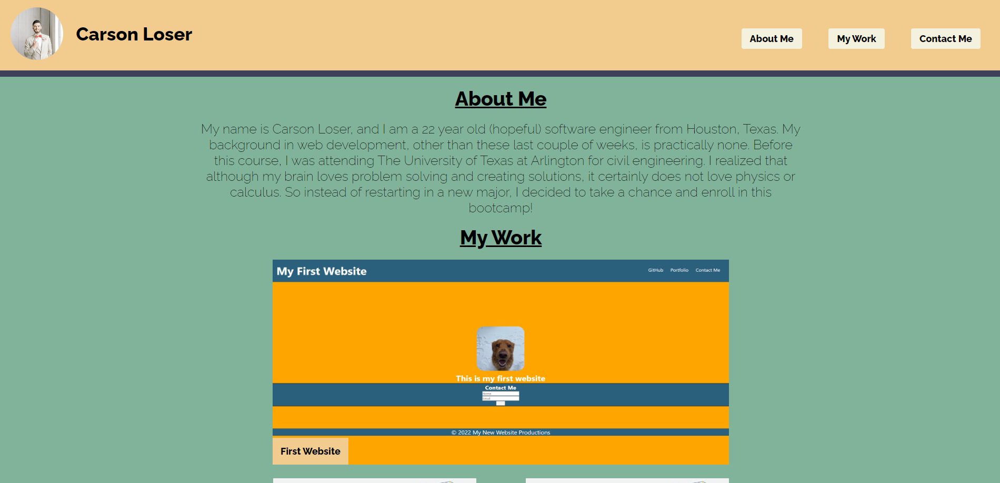

# First Portfolio

#### By Carson Loser

#### This application provides potential employers direct access to my work, as well as sections about my personal life, as well as ways to contact me.

# Prerequisites and Dependencies

* Presence of developers name, recent profile picture or avatar, and links to sections about them, their work, and how to contact them.

* Navagation links & UI scroll to their corresponding sections.

* The 'My Work' link in the Navagation bar scrolls to a section with titled images of the developer's current applications.

* The developer's first application image should be larger in size than the others.

* Clicking on the images of the applications takes user to that deployed application.

* Still presented with a responsive layout that adapts to the viewport when resizing the page or viewing the site on various screens and devices.

# Live Server URL

- https://carson-loser.github.io/first-portfolio/

# Assets

The following image demonstrates the web application's appearance and functionality:

